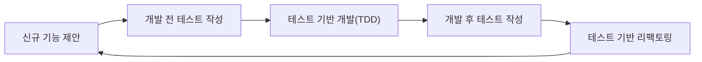
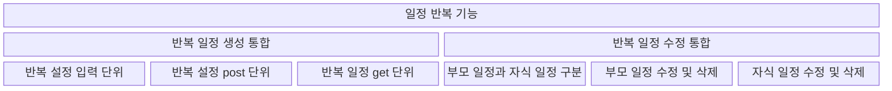
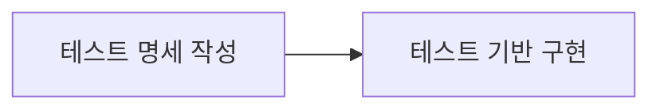
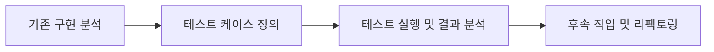

# 테스트 전략 개요

- 본 프로젝트에서는 `vitest`를 테스팅 라이브러리로 사용합니다.
- 본 프로젝트에서는 `msw(mock service worker)`를 사용합니다.

> 요구사항 구현에 있어서 `Test Driven Development`를 지향합니다. 이를 위해 요구 사항을 구체화하여 테스트 코드로 작성한 뒤, 테스트를 만족시키는 것을 최소목적으로 하는 애플리케이션 설계 및 개발에 착수합니다. 구현 이전에 작성되는 테스트는 `개발 전 테스트(Test Before Development)`라고 부르며, 요구사항의 scope에 따라 `유닛 테스트`, `통합 테스트`, `E2E 테스트` 등 다양한 방식으로 작성될 수 있습니다.
> 
> 또한 구현 검증 및 유지보수 안정성 향상을 위해 `Development` 과정 이후에 작성되는 테스트를 `개발 후 테스트(Test After Development)`로 분류합니다. 생산된 각 모듈 단위(`hook`, `util`, `component`)에 대하여 `유닛 테스트`를 작성하며, 가능할 경우 새로운 유저 플로우에 대한 `E2E 테스트` 및 `시나리오 테스트`까지 작성하는 것을 목표로 합니다.
> 
> 위와 같이 `개발 전 테스트(Test Before Development)` 작성과 `개발 후 테스트(Test After Development)` 작성을 분리하며, 우선순위는 개발 전 테스트를 높게 평가합니다.

## 개발 전 테스트와 개발 후 테스트

해당 프로젝트의 전체적인 개발 프로세스는 아래와 같습니다.

### 개발 전 테스트(Test Before Development)
- 개발 전 테스트는 전반적으로 `하향식`으로 작성됩니다.
- 구현은 대부분 `사용자 기능(feature)`를 기준으로 제안되기 때문에, 제안된 기능 단위를 가장 큰 단위로 하여 하향식으로 진행됨을 의미합니다.
- 개발 기간을 고려하여 모든 테스트를 작성하고 개발에 착수하지 아니하고 `현재 개발하려는 시점에서 필요한 최소한의 범위에서 테스트를 완성하고 개발에 착수`하는 방식으로 진행합니다.
- 구현 단계에서 구현물에 대한 설계를 한 이후에 인터페이스 분리 여부와 관계 없이 그 시점에 테스트를 작성하도록 합니다.
- 현재 개발하려는 모듈 단위에 대한 테스트는 모두 작성되어 있어야 합니다.
- 현재 개발하려는 범위를 포함하고 있는 상위 범위에서의 테스트는 모두 작성되어 있어야 합니다.

### 개발 후 테스트(Test After Development)
- 개발 후 테스트는 전반적으로 `상향식`으로 작성됩니다.
- 기능의 지엽적인 구현 단계에서는 사용자 인터페이스(UI)와 최소한의 응집도를 가지도록 구성되는 util 함수나 custom hook이 작성됩니다.
- 개발 후 테스트 작성에서는 `비즈니스 로직`으로 분류될 수 있는 가장 작은 단위에 대한 테스트와, 이러한 단위들에 대한 통합 테스트를 우선으로 작성합니다.

## Test Driven Development 과정

> 테스트 단위는 제안되는 기능을 기준으로 유저기능(feature) > 통합기능(integration) > 단위기능(unit)으로 구분합니다.

요구사항에서 사용자 흐름을 기준으로 분류할 수 있는 가장 큰 기능을 `통합 기능`으로 분류하고, 이를 구현하기 위해 필요한 세부기능과 그 세부기능을 구성하는 단위기능으로 구분합니다. 테스트 기반 개발 과정의 일반적인 흐름은 아래와 같습니다.

1. 테스트 명세 작성 단계
    1. 기능 요구사항을 검토합니다.
    2. 기능 요구사항을 사용자 기능을 기준으로 최대한 크게 범주화합니다.(일정 생성 기능, 일정 검색 기능, 반복 일정 기능 등)
    3. 위의 기준을 `통합 기능`으로 분류하여, **통합 기능에 대한 테스트를 작성합니다.** 일반적으로 E2E 테스트가 될 것입니다.
    4. 통합 기능을 구성하는 세부 기능들을 정의합니다. 이는 세부 요구사항과 대응될 수 있습니다. **세부 기능에 대한 테스트를 사전에 전부 작성할 필요는 없습니다.**
    5. 세부 기능을 구성하는 단위 기능들을 정의합니다. 단위 기능은 구현 관점에서는 unit에 해당하지 않을 수 있습니다. **단위 기능에 대한 테스트를 사전에 전부 작성할 필요는 없습니다.**
2. 구현 단계
    1. 구현은 단위 기능 단위로 이루어집니다.
    2. 구현하려는 단위 기능에 구현하기 전에, 본 단위 기능의 모든 상위 분류에 대한 테스트가 작성되어야 합니다.
    3. 즉, 위 다이어그램에서 `반복 설정 입력 단위`기능을 구현하려면 적어도 아래 세 가지 테스트가 작성되어있어야 합니다.
        - `반복 설정 입력 단위` 테스트
        - `반복 일정 생성 통합` 테스트
        - `반복 일정 기능` 테스트

## 개발 후 테스트(Test After Development) 작성 요령
개발 후 테스트는 이미 개발된 프로그램에 대해 철저하게 테스트하여 안정성을 극대화하고 향후 유지보수 및 확장에 대비하는 단계입니다. 이 과정은 프로그램의 동작을 검증하고, 미래의 리팩토링이나 기능 추가, 모듈 통합 등의 작업에 대비할 수 있는 견고한 기반을 제공합니다. 다음은 개발 후 테스트를 작성하는 구체적인 흐름입니다.

1. 기존 구현 분석 단계
    - 유저 입장에서 기능을 분석하고, 개발자 입장에서 코드를 분석하는 과정을 거칩니다.
2. 테스트 케이스 정의 단계
    1. 앞서 분석한 기능과 코드를 기반으로 테스트 케이스를 작성합니다. 개발 전 테스트에서 작성되지 못한 케이스를 중심으로 작성합니다.
    2. 테스트 범위에 따라서 유닛 테스트, 통합 테스트, E2E 테스트 등 다양한 방식으로 작성할 수 있습니다.
3. 테스트 실행 및 결과 분석 단계
    - 테스트를 실행하여 결과를 분석합니다. 테스트 커버리지 등 테스트 기반의 코드 품질 평가를 구성합니다.
4. 후속 작업 및 리팩토링 단계
    - 작성된 테스트는 CI 파이프라인 등 전반적인 품질 관리 프로세스의 자산으로 활용됩니다. 이를 통해 후속 작업과 리팩토링 작업이 발생했을 때 테스트 레이어 바깥쪽에서의 변화를 최소화하면서 개발할 수 있도록 돕습니다.

## 부록

### 테스트 전략 체크리스트
- [x] 개발하려는 요구사항에 대한 테스트를 우선 작성하였는가?
- [x] 작성된 테스트를 기반으로 하여 적절한 개발을 하였는가?
- [x] CI 파이프라인에서 생성된 테스트가 자동으로 추가됨을 확인하였고, 모두 pass되었는가?
- [x] 개발 이후에도 유지보수를 위한 테스트 작성을 고려하였고, 테스트의 영역을 넓히기 위해 추가 작성하였는가?
- [x] 작성된 개발 후 테스트를 통해서 코드 품질을 평가하였는가?

### 테스트 분류별 정의
> `유닛 테스트`: 개발 후에는 각 모듈의 유닛 테스트를 작성하여, 개별 기능이 예상대로 동작하는지 확인합니다. 각 함수나 컴포넌트의 동작을 검증하고, 테스트 커버리지를 통해 코드의 안정성을 높입니다.
> 
> `통합 테스트`: 모듈 간의 상호작용을 검증하기 위해 통합 테스트를 작성합니다. 비즈니스 로직이 여러 모듈에 걸쳐 올바르게 작동하는지 검토하고, 예상치 못한 부작용이 발생하지 않는지 확인합니다.
> 
> `E2E 테스트`: 사용자 플로우를 기반으로 애플리케이션의 주요 기능이 전체적으로 잘 동작하는지 확인합니다. 실제 사용자 시나리오를 시뮬레이션하여 애플리케이션의 통합적 동작을 검증합니다.
> 
> `시나리오 테스트`: 다양한 사용자 시나리오를 고려하여 애플리케이션이 요구 사항에 맞게 동작하는지 검토합니다. 예외 상황과 경계 조건을 포함하여 시스템이 예상대로 반응하는지 확인합니다.